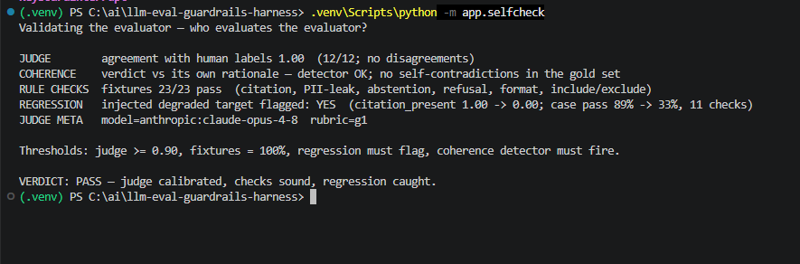

<!--
LLM Evaluation & Guardrails Harness — case study draft for tjromack.com/work/llm-eval-guardrails-harness.
Written to the site standard (cf. /work/mcp-suite): metadata block, then Overview · The Problem ·
Constraints · Architecture · Key Decisions · How It's Verified · What I'd Do Differently · Limits · Closing.
Mixed first/third person, past tense, terse. Voice per repo CLAUDE.md: state the numbers, no honesty-signalling.
Every figure is reproducible from the repo — `make selfcheck`, EVAL.md.

Image: docs/selfcheck.png lives in this folder; the path below is relative to it — repoint to the site's
asset path when porting into the site repo.
-->

# LLM Evaluation & Guardrails Harness — who evaluates the evaluator?

**Shipped:** Aug 2026 · hardened Sep 2026
**Demonstrates:** validating the evaluator itself — a judge calibrated against a human gold set, deterministic checks, and regression detection proven by an injected, known break
**Lenses:** Applied AI (primary)
**Stack:** python · pytest · fastapi · jinja · htmx · anthropic-api

> An LLM test harness that grades a target system with deterministic rule checks and a calibrated LLM judge, and catches
> regressions between versions — and it validates itself first: the judge agrees with a human gold set 12/12, every
> rule-check fixture passes, and an injected regression is caught.

## Overview

The harness tests an LLM system the way you'd test software: a test set of cases runs through the target via a thin
adapter, each output is scored by a mix of deterministic rule checks and a calibrated LLM judge, and runs are stored so
a later version can be compared against an earlier one to flag regressions. The first wired target is a regulatory RAG
copilot; the same harness grades any LLM system by writing an adapter. It is the capstone of the portfolio — the tool
that evaluates the other projects.

The part that makes it trustworthy is that it answers its own hardest question first. An evaluator whose judge is
miscalibrated, or whose checks are buggy, is worse than no evaluator — it manufactures confidence. So before the harness
grades anything else, `make selfcheck` grades the harness: it measures the judge against human labels, exercises every
deterministic check against known-good and known-bad fixtures, and confirms that a deliberately injected regression is
actually caught.

*`make selfcheck` — the harness graded against itself: the judge agrees with the human gold set (1.00, 12/12), every
rule-check fixture passes (23/23), and an injected regression is caught (`citation_present 1.00 → 0.00`).*

## The Problem

Anyone can get an LLM feature to look good in a demo. Knowing whether it is actually good — and whether a prompt tweak,
a model swap, or a new release quietly broke it — requires measurement, and most projects do not have it. The gap is
between "it worked when I tried it" and "here are the numbers, and here is what changed."

But standing up an evaluator does not close that gap on its own. A judge that disagrees with human reviewers, or a check
that silently passes bad output, produces numbers that are worse than no numbers, because they are believed. The real
problem is therefore two problems: measure the target, and prove the instrument doing the measuring can be trusted.

## Constraints

- **Synthetic and public test data only** — no PHI, no internal systems. The gold set and the fixtures are authored for
  this project.
- **The judge is non-deterministic**, so a single judged run is a sample, not a measurement — the design had to treat it
  as one.
- **Deterministic checks carry the load; the judge is scoped to the qualitative.** A property that a rule can check must
  not be handed to a model.
- **It has to run offline.** Without a provider key the self-check falls back to an offline mock judge and must say so —
  a mock number cannot be mistaken for calibration.
- **A blind spot must not read as a failure.** When the harness cannot measure something, it has to report that, not
  blame the target for its own instrument gap.

## Architecture

The pipeline is: a **test set** of cases (input, reference/expected behaviour, and the checks that should pass, including
adversarial and guardrail cases) → a **runner** that executes the target through a thin adapter, capturing each output →
**two-layer scoring** → per-case and per-suite **gates** → **run comparison** that stores runs and flags deltas.

The two layers divide the work by what each is good at. **Rule checks** are deterministic: must-include / must-not-include,
format and schema, citation-present, correct abstention/refusal behaviour, and PII-leak detection. An abstention check
with no marker match *and* no judge to adjudicate returns **`unmeasured`** — an instrument gap — rather than a confident
`FAIL`. The **LLM judge** handles only the qualitative (groundedness, correctness against a reference, helpfulness)
against a versioned rubric, and because it is non-deterministic on borderline cases, `JUDGE_RUNS=N` scores each judged
check N times and reports the **distribution plus a stability flag**: a split verdict shows as `UNSTABLE` rather than a
clean pass, and a score within a band of the threshold is flagged `near-threshold`.

Regression detection is the comparison layer: run the same suite against a baseline and a candidate, and surface the
per-check deltas. A separate **coherence detector** checks the judge's verdict against its own written rationale, so a
verdict that contradicts its stated reasoning is caught rather than trusted.

## Key Decisions

1. **Deterministic checks carry the load; the judge only the qualitative.** Most of what a test needs to assert — a
   citation is present, a schema holds, an identifier leaked — is a rule, cheap and reproducible. The tradeoff is that
   the judge's error is irreducible, which is exactly why it is calibrated rather than trusted.
2. **Validate the evaluator before trusting it.** The self-check measures judge-human agreement, exercises the
   rule-check fixtures, and confirms an injected regression is caught. The tradeoff is that the human gold set is small
   (12 cases) — directional, not a benchmark — so disagreements are spot-checked by hand.
3. **Report `unmeasured`, never a false `FAIL`.** When a check has no marker and no judge to adjudicate, the harness
   reports that it could not measure the property rather than failing the target for the harness's own blind spot. The
   tradeoff is that an `unmeasured` result needs a human to resolve rather than a clean red/green.
4. **A single judged run is a sample.** `JUDGE_RUNS` plus a stability flag turns a lucky pass into a visible `UNSTABLE`,
   and a borderline score into `near-threshold`. The tradeoff is N× the judge cost when stability matters.
5. **Ship an offline mock judge that says so.** The whole harness and its self-check run without a key, so CI is free and
   a reviewer can clone and run it — but the mock's agreement is stamped `model=mock…` and carries a loud caveat, because
   a mock number is not evidence of calibration.

## How It's Verified

`make selfcheck` runs the harness against itself. Real output against the configured judge (Opus 4.8):

| Check | Result |
|---|---|
| Judge agreement with the 12-case human gold set | **1.00** (12/12) |
| Coherence — the judge's verdict vs its own rationale | no self-contradictions in the gold set |
| Rule-check fixtures (citation, PII-leak, abstention, refusal, format, include/exclude) | **23 / 23** |
| Regression — an injected degraded target is flagged | **YES** — `citation_present 1.00 → 0.00`; case pass 89% → 33% |
| Judge meta | `model=anthropic:claude-opus-4-8  rubric=g1` |
| Automated suite | **66 tests** |

The gates are hard: fixtures must be 100%, the regression must flag, and the coherence detector must fire; the judge
gate is soft for the offline mock (a loud caveat) and hard for a real provider (a real judge below 0.90 fails the run).
Run without a key, the self-check uses the offline mock judge and stamps it as such.

## What I'd Do Differently

The failure mode that would have quietly undermined everything was the judge's own non-determinism: a single judged run
read like a measurement when it was a sample, so a borderline check could pass or fail by luck and the report would look
clean either way. The fix — scoring each judged check `JUDGE_RUNS` times and surfacing a stability flag — is the thing I
would build first next time, because an evaluator's own variance is a first-class property, not a footnote. The other
change is scale: a 12-case gold set is directional, and I would grow it and add a second labeller to report inter-rater
agreement rather than leaning on one.

## Limits

- **Not a benchmark or a certification.** The judge is calibrated against a 12-case human gold set — directional, not a
  leaderboard; agreement of 1.00 means the judge and the labels agree *on this set*.
- **The judge has irreducible error**, which is why the deterministic checks carry most of the load and the judge is
  scoped to the qualitative and spot-checked.
- **Self-validation proves the harness behaves as designed, not that a suite is complete.** Coverage for any given
  target is a separate, ongoing effort.
- **Synthetic / public test data only** — no PHI, no internal systems.

## Closing

The repo is linked at the top of this page. `make selfcheck` prints the "who evaluates the evaluator?" readout — judge
agreement, the fixture count, and the caught regression — and runs offline on a mock judge with no key, or against a real
provider for a calibrated number. `EVAL.md` carries the full method: the gold set, the rubric, the fixtures, and the
thresholds each gate holds to.
